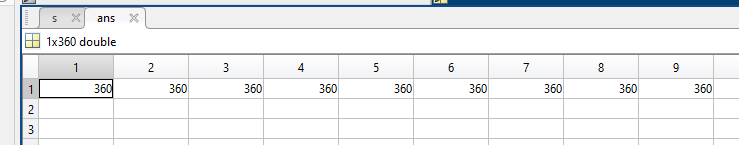

# WEEK 7

## tried to acquire ADNI raw data

applied for ADNI database access (Apr. 3)

request approved (Apr. 5)

[ADNI](https://ida.loni.usc.edu/login.jsp)

[accout]

  xingyushen
  Jigdu1-vubhed-riqnyx
  

## tried to process the data as article[^indentifying2021]

pre-process needed before bct analysis, including Correlation (assumed done) and dPSW thresholding (using threshold_proportional) and diagonal elements set to 0.

PSW is defined as the number of the retained strong weights divided by the total number of weights.

as for each individual, different PSW value should be calculated by:

$$max_{PSW}(GCE)=E-PSW$$

E is a function of PSW. Technically Varying PSW from 0.01 to 1 step 0.05 to determine the optimal PSW. plots of gces are showed below:

some of the figures seem like quadratic functions and have one peak only, but there are 2 figures out of 17 that have 2 peaks which are not expected.

whatever, I continued calculating.[calcDPSW.m](code/calcDPSW.m)[calcGlobalEfficiency.m](code/calcGlobalEfficiency.m)

|dataset|global efficiency|
|--|--|
|HC|0.3690|
|LMCI|0.3132|

images following show the parameter used by article[^indentifying2021]

- [strength](bct/strengths_und.m)
  - 
- [clustering coefficient](bct/clustering_coef_wu.m)(all weights must be between 0 and 1)
  - todo
- [local efficiency](bct/efficiency_wei.m)
  - 
  - took 20mins
- [betweenness centrality](bct/betweenness_wei.m)
  - 
  - took secs
- [eigenvector centrality](bct/eigenvector_centrality_und.m)
  - 
- [page rank centrality](bct/pagerank_centrality.m)
  - todo
- [degree](bct/degrees_und.m)
  - 

---

- small wordness index
- optimal number of modules
- mean clustering coefficient
- maximized modularity
- glocal efficiency
- characteristic path length
- assortativity

[^1]: A. Khazaee, A. Ebrahimzadeh, and A. Babajani-Feremi, “Application of advanced machine learning methods on resting-state fMRI network for identification of mild cognitive impairment and Alzheimer’s disease,” Brain Imaging and Behavior, vol. 10, no. 3, pp. 799–817, Sep. 2016, doi: 10.1007/s11682-015-9448-7.

[^indentifying2021]: Sheng, Jinhua, Bocheng Wang, Qiao Zhang, Rougang Zhou, Luyun Wang, and Yu Xin. “Identifying and Characterizing Different Stages toward Alzheimer’s Disease Using Ordered Core Features and Machine Learning.” *Heliyon* 7, no. 6 (June 2021): e07287. https://doi.org/10.1016/j.heliyon.2021.e07287. 

