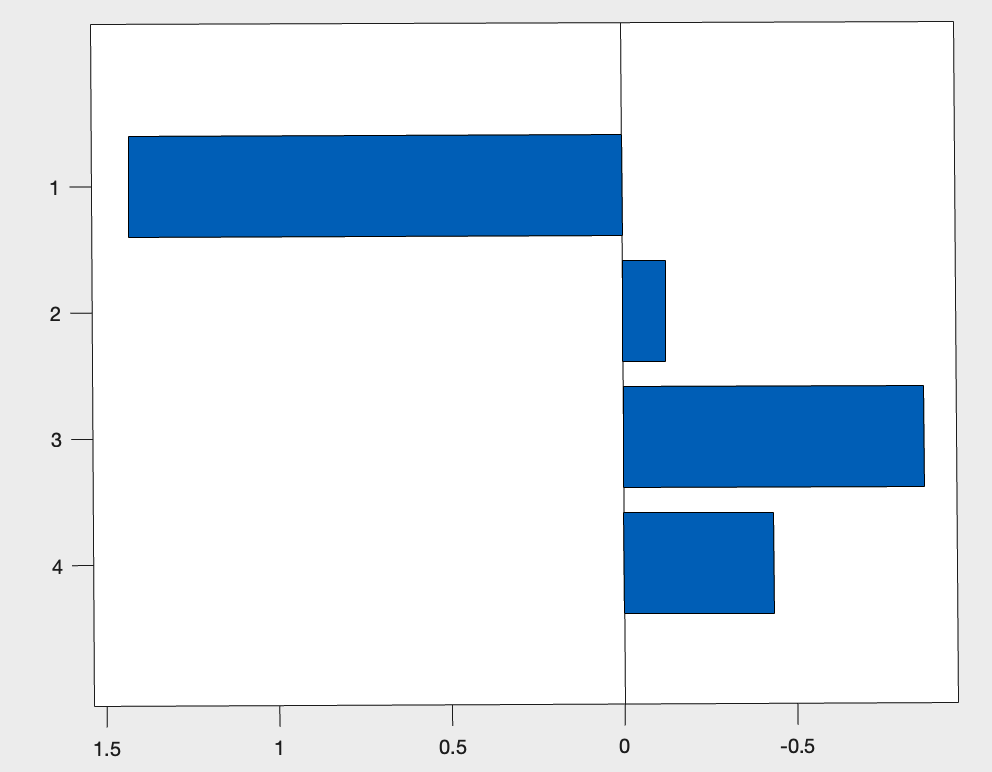
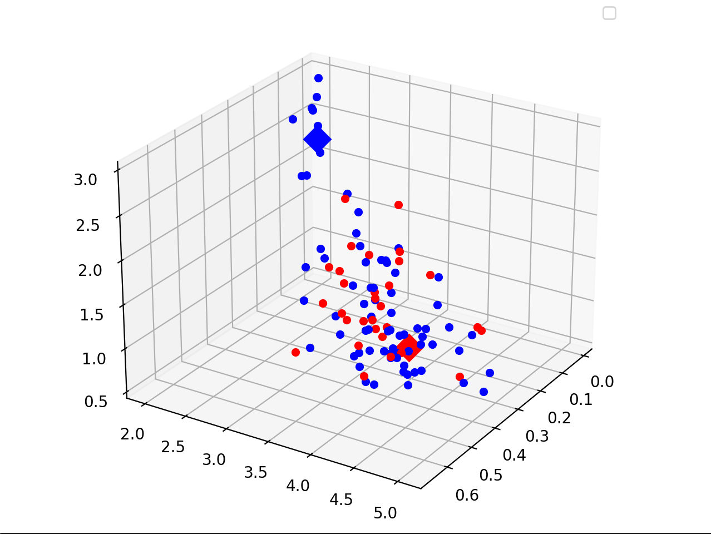

# Week 9

## adjust DPSW threshold

noticed that DPSWs are close to 0, most between 0.1 and 0.2.

we decided to use 0.01:0.01:0.25 as the threshold and step, hoping to find the optimal DPSW.

| dataset | GE(mean) | cv(变异系数) | 归一化  |
| ------- | -------- | ------------ | ------- |
| HC      | 0.3690   | 0.1509       | 0.3508  |
| EMCI    | 0.3313   | 0.2360       | 1.0492  |
| LMCI    | 0.3132   | 0.2042       | 0.5261  |
| AD      | 0.3238   | 0.0978       | -1.2245 |

it seems the figure was plotted using GE(mean), not standardized ones.

However, the comparison between the figures is meaningless. We should aim to find relations between features, not between average values.
计算并归一化这些特征是无意义的，我们应该着重于寻找单个矩阵的不同特征之间的联系，而不是比较不同类型（症状）矩阵的总体区别。

## 已经计算的特征

- assortativity  [同配系数](https://zh.wikipedia.org/wiki/%E5%90%8C%E9%85%8D%E6%80%A7)
- charpath    网络的特征路径长度是网络中所有节点之间的平均最短路径长度。 输入的距离矩阵需要先使用distance_wei获得
  - distance_wei    输入的是长度矩阵而不是权重矩阵，需要先通过取倒数`m=1./m`获得长度矩阵。
- small world index   小世界系数 $\sigma=\frac{\gamma}{\lambda}=\frac{C/{C_{random}}}{L/L_{random}}$
  - $C$ clustering coefficient  得到的向量是每个节点的聚类系数，要得到图的聚类系数，需要对向量求平均数 $C=\frac{1}{length}\Sigma_{k\in(0,length)}C_k$
  - $L$ charpath 平均最短路径长度 
  - random 表示随机网络的聚类系数和最短路径长度 在[这个网站](https://www.modb.pro/db/137781)上可以找到1000个随机网络的聚类系数和平均最短路径长度为0.1854918和1.839482
  
## 聚类

初步使用上述三个特征在三维空间中进行聚类，图中红色的点是AD患者，蓝色的点是其他人，菱形的色块是聚类中心。

准确率是0.3725，可以说是比瞎猜稍微强一点。

结论：聚类方法不可用，因为这些数据点在空间内没有明显的分区，聚类不可能将他们分开。