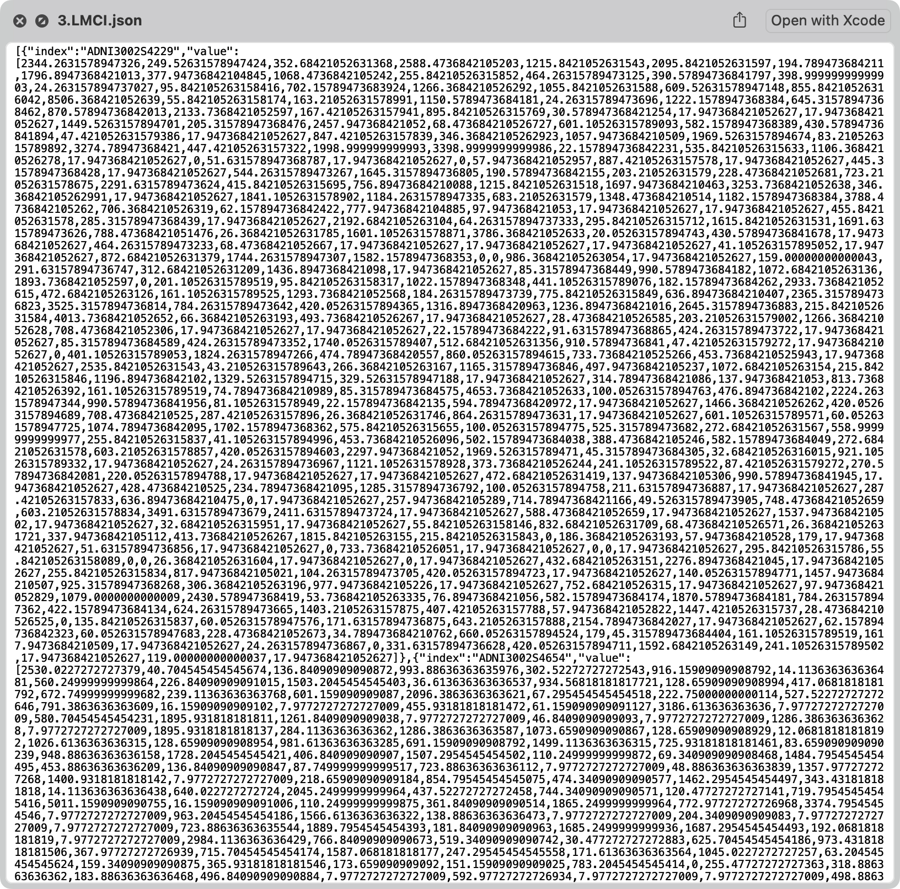
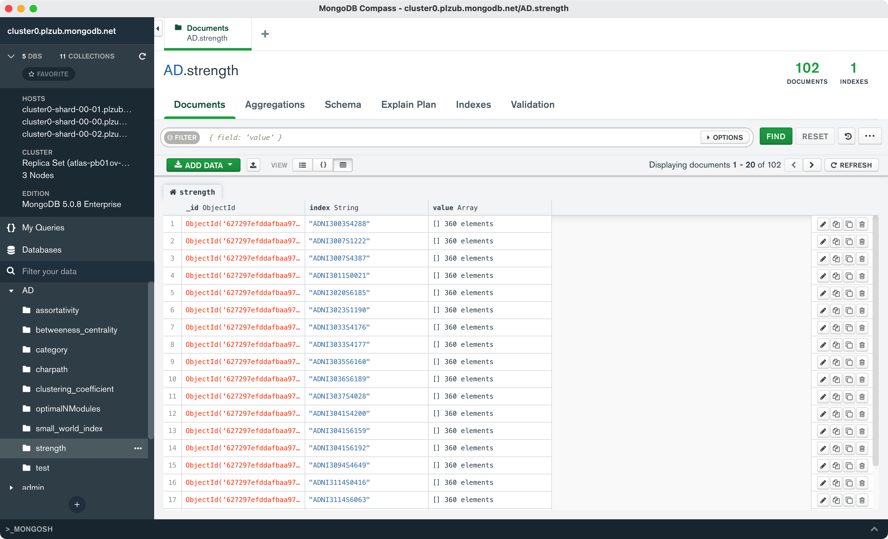
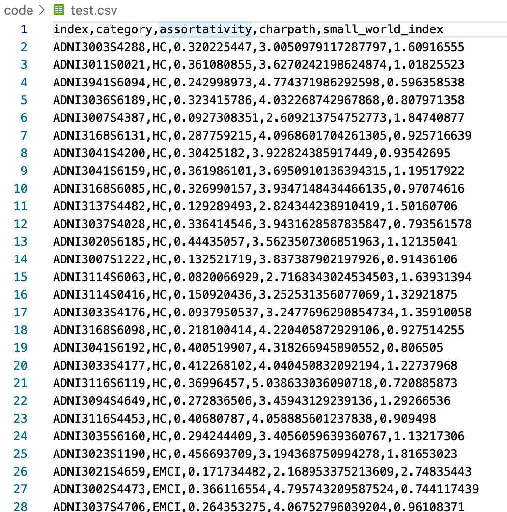

# Week 11

TARGET:

- find implemention of BP and more ML techniques in python.
- calculate more characteristics of the brains.
- store them in a decent way.

## ML techniques

Found a repo of some ML techniques implemented in python including BP, SVM, K-Means, etc.

https://github.com/lawlite19/MachineLearning_Python

I tried BP. The accuracy is pretty low. Just a little bit better than guessing.

Thats what reminds me that "K_Means is not funtional in the project" is not true. Because the earlier demos are limited to 3 dimensions in which no ML method can perform corrcetly.

**The urgent need is acquire more characteristics but bot blame ML methods**

## More characteristics

### chars that have been calculated:

- assortativity
- charpath
- small_world_index
- clustering_coefficient(360 vector)

### Done this week

- maximized modularity: 将所有点分组，使得组内节点连接最大化，组间最小化。output: [Ci, Q]. Q is the maximized modularity.
- mean clustering coefficient: clustering coefficient 的平均值。
- sthength (360 vector)
- local efficiency TODO (360 vector)
- betweenness centrality (360 vector)

## manage the data

1. store matlab varables in json. 
2. read the json files into mongoDB. 
3. combine characteristics into one csv file in Python.
4. perform ML methods on these csv files.
