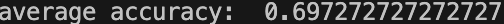

# Week 13

- [Week 13](#week-13)
- [TARGET](#target)
- [Train & Test](#train--test)
  - [accuracy](#accuracy)
- [SVM, DTree, Bayes,](#svm-dtree-bayes)
- [Demensionality reduction](#demensionality-reduction)
  - [code](#code)

# TARGET

- [x] split train set and test set (code)
- [x] try different machine learning methods
- [ ] try to select different combines of charactors to maxmize accuracy
- [ ] learn about ML and small samples
  - [x] PCA https://zhuanlan.zhihu.com/p/77151308

# Train & Test

Rather than random choices among all the samples, I make random choices for each classes and then combine them, which guarantees that the ratio of different classes is fixed.

If not, train or test set could be lack of one of the classes due to smallness of dataset.

Also, my code is also capable to custom test_set_size, chars_selection, classes_selection

To test multiple times and calculate the mean accuracy, and get the best performance in the meantime, multi-threading is applied to the code.

## accuracy

100 times average:

# SVM, DTree, Bayes, MLP

|                 ML Methods | 1000times accuracy  |
| -------------------------: | :-----------------: |
|                        SVM | 0.69727272727272727 |
|              Decision Tree | 0.5603636363636353  |
|       Gaussion Naive Bayes | 0.6146363636363641  |
| Multi-layer Neural Networl | 0.6545454545454545  |

# Demensionality reduction

1. normalize the data to average 0.

2. find the basis which could maxmize **variance** after applying PCA

> 2-dim -> n-dim
> 
> variance -> covariance

$Variance(a)=\frac{1}{m}\Sigma_{i=1}^m(a_i-\mu)^2$

$Covariance(a,b)=\frac{1}{m-1}\Sigma_{i=1}^m(a_i-\mu_a)(b_i-\mu_b)$

将一组 N 维向量降为 K 维，其目标是选择 K 个单位正交基，使得原始数据变换到这组基上后，各变量两两间协方差为 0，而变量方差则尽可能大（在正交的约束下，取最大的 K 个方差）。

> 设我们有 m 个 n 维数据记录，将其排列成矩阵$X_{n,m}$，设 $C=\frac{1}{m}XX^T$，则 C 是一个对称矩阵，其对角线分别对应各个变量的方差，而第 i 行 j 列和 j 行 i 列元素相同，表示 i 和 j 两个变量的协方差。
> 
> 根据我们的优化条件，我们需要将除对角线外的其它元素化为 0，并且在对角线上将元素按大小从上到下排列（变量方差尽可能大），这样我们就达到了优化目的。
>
> 设原始数据矩阵 X 对应的协方差矩阵为 C，而 P 是一组基按行组成的矩阵，设 Y=PX，则 Y 为 X 对 P 做基变换后的数据。设 Y 的协方差矩阵为 D，我们推导一下 D 与 C 的关系：
> 
> $D=\frac{1}{m}YY^T\\
=\frac{1}{m}(PX)(PX)^T\\
=\frac{1}{m}PXX^TP^T\\
=P(\frac{1}{m}XX^T)P^T\\
=PCP^T$
> 
> 这样我们就看清楚了，我们要找的 P 是能让原始协方差矩阵对角化的 P。换句话说，优化目标变成了寻找一个矩阵 P，满足 $PCP^T$ 是一个对角矩阵，并且对角元素按从大到小依次排列，那么 P 的前 K 行就是要寻找的基，用 P 的前 K 行组成的矩阵乘以 X 就使得 X 从 N 维降到了 K 维并满足上述优化条件。
> 
> 总结一下 PCA 的算法步骤：
>
> 设有 m 条 n 维数据。
>
> 1. 将原始数据按列组成 n 行 m 列矩阵 X；
> 1. 将 X 的每一行进行零均值化，即减去这一行的均值；
> 1. 求出协方差矩阵 $C=\frac{1}{m}XX^T$ ；
> 1. 求出协方差矩阵的特征值及对应的特征向量；
> 1. 将特征向量按对应特征值大小从上到下按行排列成矩阵，取前 k 行组成矩阵 P；
> 1. $Y=PX$ 即为降维到 k 维后的数据。

> 1. 缓解维度灾难：PCA 算法通过舍去一部分信息之后能使得样本的采样密度增大（因为维数降低了），这是缓解维度灾难的重要手段；
>
> 1. 降噪：当数据受到噪声影响时，最小特征值对应的特征向量往往与噪声有关，将它们舍弃能在一定程度上起到降噪的效果；
> 
> 1. 过拟合：PCA 保留了主要信息，但这个主要信息只是针对训练集的，而且这个主要信息未必是重要信息。有可能舍弃了一些看似无用的信息，但是这些看似无用的信息恰好是重要信息，只是在训练集上没有很大的表现，所以 PCA 也可能加剧了过拟合；
> 
> 1. 特征独立：PCA 不仅将数据压缩到低维，它也使得降维之后的数据各特征相互独立；

## code 

