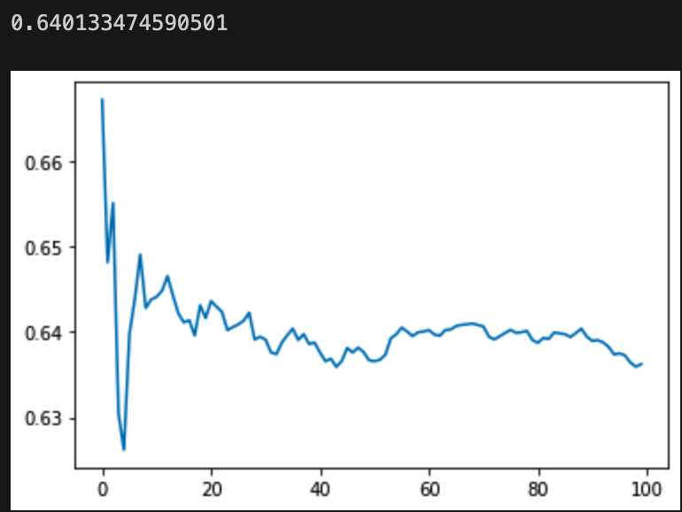
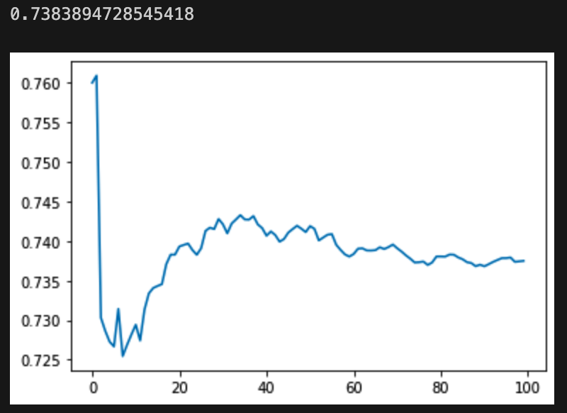

所有10个local特征放在一起降维到10个参数，再和global特征拼接


10个local和9个global放在一起，降维到10个参数
```C
int main(){
    // 全局特征
    float global_feature[9];
    // 局部特征
    float local_feature[10];
    // 全局特征和局部特征拼接
    float feature[19];
    // 全局特征和局部特征拼接的降维后的参数
    float parameter[10];
    // 全局特征和局部特征拼接的降维后的参数
    float parameter_2[10];
    // 全局特征和局部特征拼接的降维后的参数
    float parameter_3[10];
    // 全局特征和局部特征拼接的降维后的参数
    float parameter_4[10];
    // 全局特征和局部特征拼接的降维后的参数
    float parameter_5[10];
    // 全局特征和局部特征拼接的降维后的参数
    float parameter_6[10];
    // 全局特征和局部特征拼接的降维后的参数
    float parameter_7[10];
    // 全局特征和局部特征拼接的降维后的参
}
```